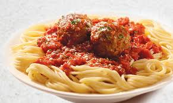

# Methods

We describe our methods in this chapter.


## Gallery via links
From here <http://www.littlewebhut.com/articles/html_iframe_example/>

<iframe frameborder="0" scrolling="no" width="130" height="198" src="images/eightball.gif" name="imgbox" id="imgbox">
   <p>iframes are not supported by your browser.</p>
</iframe><br />
<a href="images/redball.gif" target="imgbox">Red Ball</a><br />
<a href="images/floatingball.gif" target="imgbox">Floating Ball</a><br />
<a href="images/eightball.gif" target="imgbox">Eight Ball</a>

## Video
```{r echo=FALSE}
knitr::include_url("https://www.youtube.com/embed/9bZkp7q19f0?rel=0")
```


```{r echo=FALSE}
#Raster graphics n- won't install in linux mint
#install.packages("png")
#library("png")
#ball <- readPNG("images/squirrel.png", native = TRUE)
#plot(0:1, 0:1, type = "n", ann = FALSE, axes = FALSE)
#rasterImage(ball, 0, 0, 1, 1)
```
-->

- Turn off alarm
- Get out of bed

## Breakfast

- Eat eggs
- Drink coffee


## Dinner

- Eat spaghetti
- Drink wine

----



## Going to sleep

- Get in bed
- Count sheep
