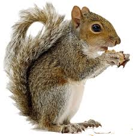
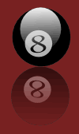

# slide show
<h2> slide show</h2>

The slideshow is an object, with methods like next/previous:

<button onclick="myShow.previous()">Previous</button>
<button onclick="myShow.next()">Next</button>

<button onclick="myShow2.previous()">Previous</button>
<button onclick="myShow2.next()">Next</button>

