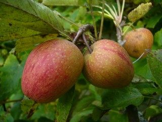
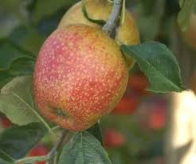
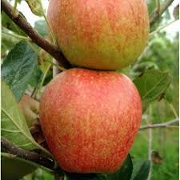

## Adams Pearmain Apple

<link type="text/css" rel="stylesheet" href="featherlight.css" />
<link type="text/css" rel="stylesheet" href="featherlight.gallery.css" />

<h2>Description</h2>

In 1826, Robert Adams introduced this fine English dessert apple as Norfolk Pippin. Other sources indicate this apple originated in the county of Herefordshire, England and was locally known as Hanging Pearmain. The apple known as Adams Pearmain today is a medium-sized, very conical fruit with dull crimson-red skin covered with a fine gray-brown russet coat. The creamy white flesh is crisp, tender and firm with a dry, nutty flavor. Ripens mid-late October.

<h2> Gallery </h2>

