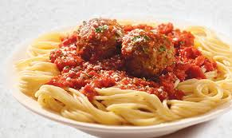

--- 
title: "My Book"
author: "Mark Lee"
date: "`r Sys.Date()`"
site: bookdown::bookdown_site
output: bookdown::gitbook
documentclass: book
bibliography: [book.bib, packages.bib]
biblio-style: apalike
link-citations: yes
github-repo: rstudio/bookdown-demo
description: "This is a minimal example of using the bookdown package to write a book. The output format for this example is bookdown::gitbook."
---

# Prerequisites

This is a _sample_ book written in **Markdown**. Use anything that Pandoc's Markdown supports, e.g., a math equation $a^2 + b^2 = c^2$.

The **bookdown** package can be installed from CRAN or Github:

```{r eval=FALSE}
install.packages("bookdown")
# or the development version
# devtools::install_github("rstudio/bookdown")
```

Remember each Rmd file contains one and only one chapter, and a chapter is defined by the first-level heading `#`.

To compile this example to PDF, you need XeLaTeX. You are recommended to install TinyTeX (which includes XeLaTeX): <https://yihui.name/tinytex/>.

```{r include=FALSE}
# automatically create a bib database for R packages
knitr::write_bib(c(
  .packages(), 'bookdown', 'knitr', 'rmarkdown'
), 'packages.bib')
```

Added to the bottom of the page!

<!--chapter:end:index.Rmd-->

# Introduction {#intro}

Hooray! Yoohoo! Oh boy! You can label chapter and section titles using `{#label}` after them, e.g., we can reference Chapter \@ref(intro). If you do not manually label them, there will be automatic labels anyway, e.g., Chapter \@ref(methods).

Figures and tables with captions will be placed in `figure` and `table` environments, respectively.

```{r nice-fig, fig.cap='Here is a nice figure!', out.width='80%', fig.asp=.75, fig.align='center'}
par(mar = c(4, 4, .1, .1))
plot(pressure, type = 'b', pch = 19)
```

Reference a figure by its code chunk label with the `fig:` prefix, e.g., see Figure \@ref(fig:nice-fig). Similarly, you can reference tables generated from `knitr::kable()`, e.g., see Table \@ref(tab:nice-tab).

```{r nice-tab, tidy=FALSE}
knitr::kable(
  head(iris, 20), caption = 'Here is a nice table!',
  booktabs = TRUE
)
```

You can write citations, too. For example, we are using the **bookdown** package [@R-bookdown] in this sample book, which was built on top of R Markdown and **knitr** [@xie2015].

<!--chapter:end:01-intro.Rmd-->

# Literature

Here is a review of existing methods.

<!--chapter:end:02-literature.Rmd-->

# Methods

We describe our methods in this chapter.


## Gallery via links
From here <http://www.littlewebhut.com/articles/html_iframe_example/>

<iframe frameborder="0" scrolling="no" width="130" height="198" src="images/eightball.gif" name="imgbox" id="imgbox">
   <p>iframes are not supported by your browser.</p>
</iframe><br />
<a href="images/redball.gif" target="imgbox">Red Ball</a><br />
<a href="images/floatingball.gif" target="imgbox">Floating Ball</a><br />
<a href="images/eightball.gif" target="imgbox">Eight Ball</a>

## Video
```{r echo=FALSE}
knitr::include_url("https://www.youtube.com/embed/9bZkp7q19f0?rel=0")
```

## Raster graphics
```{r echo=FALSE}
#install.packages("png")
library("png")
ball <- readPNG("images/squirrel.png", native = TRUE)
plot(0:1, 0:1, type = "n", ann = FALSE, axes = FALSE)
rasterImage(ball, 0, 0, 1, 1)
```


- Turn off alarm
- Get out of bed

## Breakfast

- Eat eggs
- Drink coffee


## Dinner

- Eat spaghetti
- Drink wine

----



## Going to sleep

- Get in bed
- Count sheep

<!--chapter:end:03-method.Rmd-->

# Applications

Some _significant_ applications are demonstrated in this chapter.

## Example one

## Example two

<!--chapter:end:04-application.Rmd-->

# Final Words

We have finished a nice book.

<!--chapter:end:05-summary.Rmd-->

`r if (knitr:::is_html_output()) '
# References {-}
'`

<!--chapter:end:06-references.Rmd-->

